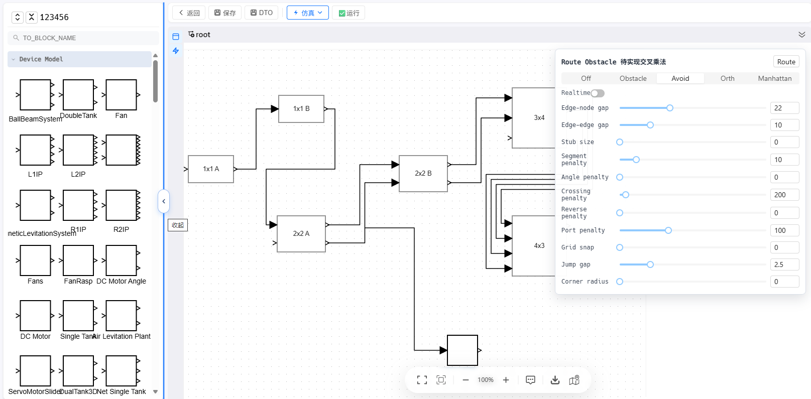
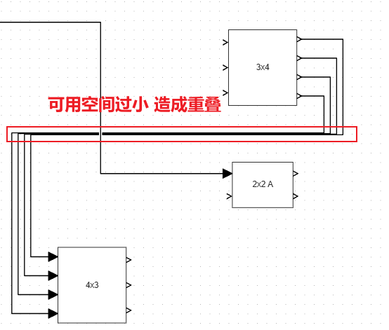

# M2PLink Route Demo

本 feat 分支为开发和改进 block diagram 的路由 demo。

Cloudflare deploy: https://feat-avoidrouter.antvx6.pages.dev



## 功能说明

打开主页面后，可以通过右侧 panel 面板切换路由引擎并调节参数，实时观察不同路由策略的效果。

当前 demo 支持体验：

- obstacle routing
- avoid routing
- orthogonal routing
- Manhattan routing

## 路由引擎说明

| 引擎      | 说明                                                                                                            |
| --------- | --------------------------------------------------------------------------------------------------------------- |
| Off       | 关闭自动路由，清空 demo 路由产生的 router 和 vertices。                                                         |
| Obstacle  | 使用 `obstacle-router` 计算正交避障路径；边到边分支（`source/target` 为 Edge-branch）会使用 X6 Manhattan 路由。 |
| Avoid     | 使用 `libavoid-js` 计算正交避障路径；边到边分支（`source/target` 为 Edge-branch）会使用 X6 Manhattan 路由。     |
| Orth      | 使用 X6 内置 `orth` 路由，适合快速观察基础正交连线效果。                                                        |
| Manhattan | 使用 X6 内置 `manhattan` 路由，支持更多网格、方向和搜索参数。                                                   |

## 参数说明

### 通用参数

| 参数          | 默认值     | 适用引擎                            | 说明                                                          |
| ------------- | ---------- | ----------------------------------- | ------------------------------------------------------------- |
| Realtime      | `false`    | 全部                                | 是否在参数变化时实时重新路由。关闭后可以手动点击 Route 触发。 |
| Jump gap      | `GAP_SIZE` | Obstacle / Avoid / Orth / Manhattan | 连线交叉时 jump-over 的缺口大小。值越大，跨线缺口越明显。     |
| Corner radius | `0`        | Obstacle / Avoid / Orth / Manhattan | 连线拐角圆角半径。`0` 表示直角折线。                          |

### Obstacle / Avoid 参数

| 参数             | 默认值       | 适用引擎         | 说明                                                                         |
| ---------------- | ------------ | ---------------- | ---------------------------------------------------------------------------- |
| Edge-node gap    | `8`          | Obstacle / Avoid | 连线与节点之间的最小避让距离。值越大，线会离节点更远。                       |
| Edge-edge gap    | `10`         | Obstacle / Avoid | 多条连线之间的理想间距。值越大，平行线更容易被分开。                         |
| Stub size        | `24`         | Obstacle / Avoid | 端口引出的短直线长度，用于让连线先按端口方向离开节点再参与路由。             |
| Segment penalty  | `10`         | Obstacle / Avoid | 线段数量惩罚。值越大，路由越倾向于减少折线段数量。Avoid 模式下最小值为 `1`。 |
| Angle penalty    | `0`          | Obstacle / Avoid | 转角惩罚。值越大，路由越倾向于减少拐弯。                                     |
| Reverse penalty  | `0`          | Obstacle / Avoid | 反向出线惩罚。值越大，越不希望连线从端口方向的反方向绕出。                   |
| Port penalty     | `100`        | Obstacle / Avoid | 端口方向惩罚。值越大，越倾向于遵守端口声明的出入方向。                       |
| Grid snap        | `GRAPH_GRID` | Obstacle / Avoid | 路由点吸附到网格的尺寸。`0` 表示不做网格吸附。                               |
| Crossing penalty | `200`        | Avoid            | 交叉惩罚。值越大，libavoid 越倾向于避开连线交叉。                            |

### Orth 参数

| 参数    | 默认值 | 适用引擎 | 说明                                                               |
| ------- | ------ | -------- | ------------------------------------------------------------------ |
| Padding | `20`   | Orth     | X6 `orth` 路由的避让 padding。值越大，路径会尝试离节点或障碍更远。 |

### Manhattan 参数

| 参数                 | 默认值 | 适用引擎  | 说明                                                                         |
| -------------------- | ------ | --------- | ---------------------------------------------------------------------------- |
| Padding              | `20`   | Manhattan | X6 `manhattan` 路由的避让 padding。                                          |
| Step                 | `10`   | Manhattan | Manhattan 搜索网格步长。值越小，路径搜索更细；值越大，路径更粗略但计算更快。 |
| Max loops            | `2000` | Manhattan | Manhattan 路由最大搜索次数。复杂图中可以调大，避免过早放弃搜索。             |
| Precision            | `1`    | Manhattan | 路由精度参数。值越高，路径判断更宽松。                                       |
| Max direction change | `90`   | Manhattan | 单次允许的最大方向变化角度。通常 `90` 表示标准正交折线。                     |
| Perpendicular        | `true` | Manhattan | 是否优先让连线垂直连接到节点端口。                                           |
| Snap to grid         | `true` | Manhattan | 是否将 Manhattan 路由结果吸附到网格。                                        |

## 本地启动

先安装依赖：

```bash
pnpm install
```

启动开发服务：

```bash
pnpm dev
```

然后在浏览器中访问：

```text
http://localhost:5173
```

## 参与改进

使用 `clone/fork` 仓库，在本地进行调试修改。

通过调整路由参数或实现逻辑，通过提交 PR 到 feat/avoidRouter 分支完成合并。

[第一次PR教程参考](https://github.com/firstcontributions/firstcontributions.github.io)

改进方向：

（一）当节点空间小于最小edge-edge gap空间时压缩过小重叠问题



## 参考

X6 示例：  
https://x6.antv.antgroup.com/examples/edge/router/#normal

obstacle-router：  
https://github.com/awaisshah228/avoid-edge-routing

avoid：  
https://www.adaptagrams.org/documentation/libavoid.html
